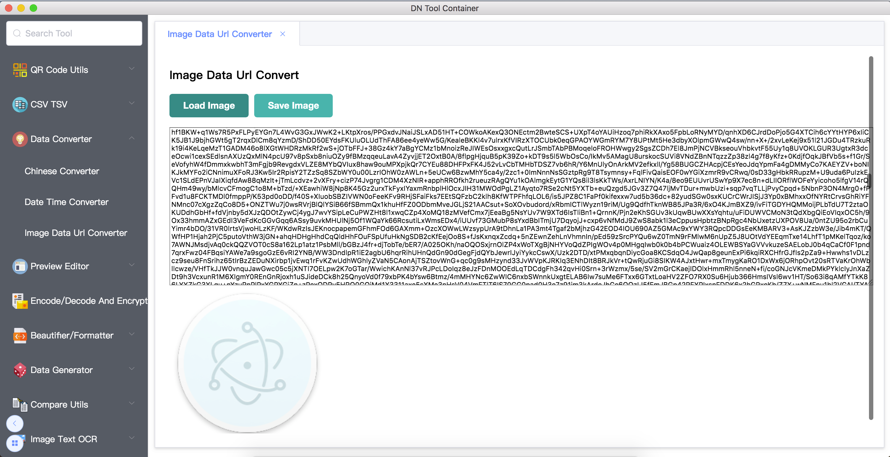

# Dn Tool Container

 

An application can install many convenient tools for platforms of OS X 、Windows and Linux .

### Package Source Code

* Beautifier/Formatter : https://github.com/como65416/simple-beautifier-formatter-tool

* Encode/Decode And Encrypt : https://github.com/como65416/simple-encode-decode-tool

## Usage

### Install tool

* Open the Applcation and click  button

* Select package which you want to install and click the install button.

* Enjoy it !

