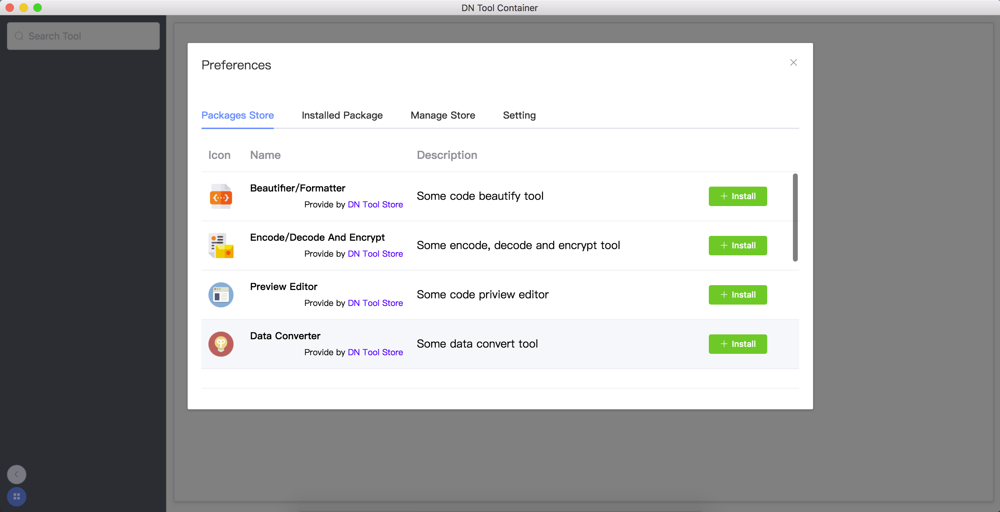

# Dn Tool Container

An application can install many convenient tools.

## Usage

### Install tool

* Open the Applcation and click  button

* Select package which you want to install and click the install button.

* Enjoy it !

