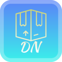
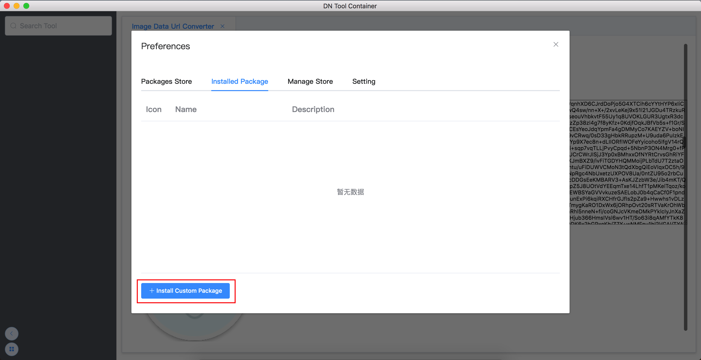
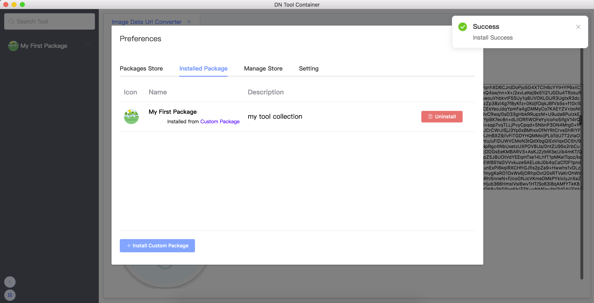

# DN Tool Container

 

An application can install many convenient tools for platforms of OS X 、Windows and Linux .
It can get more and more convenience tool in the future and no need reinstall Application.

### Downloads

[GitHub Releases](https://github.com/como65416/DnToolContainer/releases)

### Package Source Code Repo

* [Beautifier/Formatter](https://github.com/como65416/simple-beautifier-formatter-tool)

* [Encode/Decode And Encrypt](https://github.com/como65416/simple-encode-decode-tool)

* [Data Converter](https://github.com/como65416/simple-data-converter)

* [Preview Editor](https://github.com/como65416/simple-preview-editor)

* [TSV/CSV Editor](https://github.com/como65416/csv-tsv-editor)

* [Data Generator](https://github.com/como65416/data-generator)

* [Compare Utils](https://github.com/como65416/compare-utils)

* [QR Code Utils](https://github.com/como65416/QR-Code-Utils)

* [Image Text OCR](https://github.com/como65416/Image-Text-OCR)

## Usage

### Install tool from store

* Open the Applcation and click  button

* Select package which you want to install and click the install button.

* Enjoy it !

### Install tools from custom package

You can package your tools by [DN Tool Packager](https://github.com/como65416/dn-tool-packager)

* Open the Applcation and click  button

* Click `Install Custom Package` button in `Installed Package` page and select the package which you want to install.

* Installed !

### Host your custom package store server

You can install your custom package store server : [DN Tool Container Store API Server](https://github.com/como65416/DN-Tool-Container-Store-API-Server)

### Add custom package store to DnToolContainer

* Open the Applcation and click  button

* To `Manage Store` page and click `Add Store` button

* You will see your packages in `Package Store` page after new store config saved.

